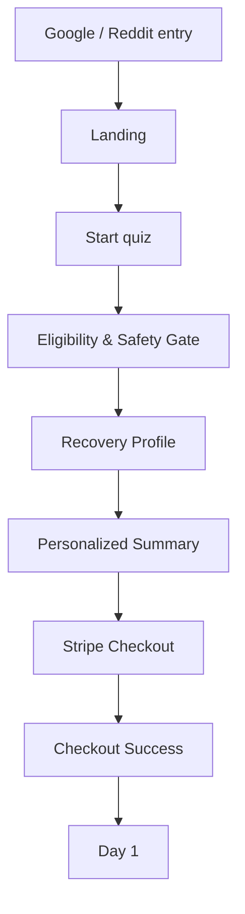
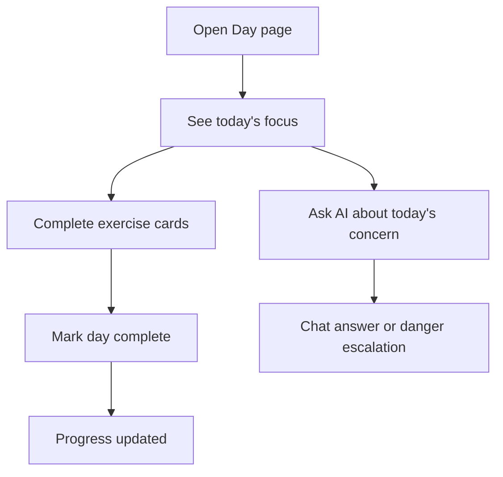

---
stepsCompleted:
  - ux-page-spec-ready
inputDocuments:
  - D:\work\MyStartupProject1\产品Brief.md
  - D:\work\MyStartupProject1\路线图与MVP.md
  - D:\work\MyStartupProject1\技术架构详细设计.md
status: ready_for_story_split
---

# UX 设计规格说明：Fracture Recovery AI Companion

> 版本：v1.0
> 日期：2026-04-22
> 范围：`Landing / Onboarding / Day / Chat`
> 目标：把 4 个关键页面收口到“可直接拆 stories”的粒度

---

## 1. 设计目标

本规格只解决一件事：

- 把当前已有的 `Brief + 路线图 + 技术方案`
- 进一步压实成 `页面级 UX 输入`
- 让后续 `epics/stories` 拆解不再因为页面结构反复漂移

本规格默认服务于首版 MVP：

- 海外英语用户
- 手指 / 掌骨
- 拆石膏前后 14 天
- `$14.99` 一次性买断
- 网站首发，移动端优先

---

## 2. UX 原则

### 2.1 先减焦虑，再讲功能

用户不是来“探索产品”的，而是来确认：

- 我现在该怎么做
- 我会不会做错
- 这东西是不是刚好适合我

### 2.2 先把用户送到当天动作，再谈完整体系

首版核心不是复杂导航，而是：

- 快速判断适用性
- 快速完成问卷
- 快速完成支付
- 快速进入 Day 1

### 2.3 页面不做“内容平台味”，而做“康复陪伴味”

要避免用户觉得这只是一个科普站或便宜 AI 工具。

页面语气应突出：

- 时间窗口明确
- 行动导向明确
- 风险边界明确
- 每天有陪伴、有步骤、有反馈

### 2.4 全流程保持合规边界可见

至少在以下节点持续可见：

- Landing
- Onboarding Summary
- Day Page
- Chat Input Area

核心文案原则：

- 不是 medical device
- 不做 diagnosis
- 不替代 doctor
- 遇到危险信号立即联系医生

---

## 3. 关键用户旅程

## 3.1 主旅程：Search -> Trust -> Quiz -> Pay -> Day 1

目标：

- 从“我很焦虑”顺滑转到“我今天就能开始恢复”

## 3.2 使用旅程：Day Page -> Complete -> Progress -> Chat

目标：

- 让用户每天只关心“今天怎么做”
- 把 AI 变成辅助，不变成主流程负担

---

## 4. 共享交互模式

## 4.1 按钮层级

- `Primary`：当前页面唯一推进动作
- `Secondary`：补充信息或次级探索
- `Tertiary / Link`：低权重跳转
- `Danger / Warning`：风险确认、退出、就医提醒

约束：

- 每屏不超过 1 个 Primary
- 移动端底部 sticky 区优先承载 Primary

## 4.2 反馈模式

- `Success`：打卡完成、支付成功、问题发送成功
- `Warning`：不适用、接近额度上限、未完成全部动作
- `Error`：支付失败、网络异常、保存失败
- `Critical`：危险信号命中，不继续给普通建议

## 4.3 表单模式

- 分步表单
- 当前步即时校验
- 不在第一页一次性问完
- 每一步只处理一种认知任务

## 4.4 导航模式

- Marketing 区域：浅导航
- App 区域：任务型导航
- Day 页面优先隐藏复杂导航，只保留必要跳转

## 4.5 空状态 / 加载状态

- 所有核心页面都必须有 skeleton 或明确说明
- 空状态必须给动作，不只给一句“暂无数据”

---

## 5. Page Spec: Landing

## 5.1 页面角色

页面任务不是“完整介绍产品”，而是：

- 让用户快速判断“这就是给我的”
- 让用户愿意进入 2 分钟问卷

## 5.2 入口与出口

### 入口

- Google SEO 长尾
- Reddit 帖子
- ProductHunt / 社交分享

### 主出口

- `Start my 2-minute quiz`

### 次出口

- FAQ
- 查看 How it works
- 法律说明

## 5.3 信息结构

### Section 1: Hero

内容：

- 主标题：突出 `critical 2 weeks after cast removal`
- 副标题：突出 `daily exercises + AI answers + one-time payment`
- 主 CTA：`Start my 2-minute quiz`
- 次 CTA：`See how the 14-day plan works`
- 辅助说明：适用于哪些人，不适用于哪些人

设计意图：

- 第一屏回答“是什么、给谁、为什么现在买”

### Section 2: Pain Points

内容：

- 医生复查只有几分钟
- 搜索结果碎片化
- 害怕动错、恢复变慢

设计意图：

- 先让用户感觉“被理解”，再推进转化

### Section 3: How It Works

三步：

1. 2-minute quiz
2. One-time payment
3. Daily plan + AI answers

设计意图：

- 降低使用门槛感

### Section 4: What You Get

- Daily exercise cards
- Timer and progress
- AI answers for common concerns
- Completion summary / share

### Section 5: Safety & Disclaimer

- Not a medical device
- Not for diagnosis
- Contact your clinician for danger signs

### Section 6: FAQ

- Who is this for?
- Who is this not for?
- Why one-time payment?
- What happens if I need help?
- Refund policy

### Section 7: Footer CTA

- 重复 Primary CTA

## 5.4 关键交互

- 点击主 CTA -> `/onboarding`
- FAQ 手风琴展开
- 次 CTA 滚动到 How it works
- 不适用说明跳转免责声明或展开 warning

## 5.5 页面状态

### 正常状态

- 全部 section 正常展示

### FAQ Active

- 单条展开，不建议多条同时展开

### Unsupported Intent State

- 当用户明显不匹配目标人群时，展示 warning 文案和免责声明入口

### Low Trust Recovery

- 若用户是从广告味强的入口进来，页面需依赖 FAQ + Safety 区增强可信度

## 5.6 埋点

- `landing_view`
- `hero_cta_click`
- `how_it_works_secondary_cta_click`
- `faq_expand`
- `unsupported_warning_view`

## 5.7 Story 拆分建议

### Story L1

实现 Hero + 主 CTA + 基础首屏响应式布局

### Story L2

实现 Pain Points + How It Works + What You Get 三个内容区块

### Story L3

实现 FAQ + Safety + Footer CTA

### Story L4

补齐埋点、SEO meta、状态文案和 unsupported warning

---

## 6. Page Spec: Onboarding

## 6.1 页面角色

Onboarding 不是普通表单，而是：

- 适用性过滤器
- 恢复档案采集器
- 支付前个性化说服页

## 6.2 入口与出口

### 入口

- Landing 主 CTA
- 已登录但未付费用户重返问卷

### 主出口

- `Unlock my 14-day plan`

### 次出口

- 返回 Landing
- 上一步

## 6.3 推荐流程

### Step 1: Eligibility & Safety Gate

字段 / 判断：

- 是否已经就医
- 是否仍处于石膏 / 固定未拆状态
- 是否属于复杂或非目标骨折
- 是否存在严重异常情况

规则：

- 命中排除条件立即终止
- 不继续往后收集恢复信息

输出：

- `eligible`
- `not_eligible`
- `needs_clinician_attention`

### Step 2: Recovery Profile

字段：

- body part
- sub type
- cast removed date
- hardware yes/no
- referred to PT yes/no
- pain level
- dominant hand affected yes/no
- work type

规则：

- 每个字段都要服务于后续 Program 变体映射
- 不采“好看但没用”的字段

### Step 3: Personalized Summary + Checkout CTA

内容：

- 你当前处于哪个恢复窗口
- 接下来 14 天系统会提供什么
- 价格、退款、免责声明
- Checkout CTA

设计意图：

- 让用户感到“这是给我定制的”

## 6.4 页面结构

固定顶部：

- 当前步骤
- 进度条
- 返回按钮

中部：

- 当前步骤表单内容

底部：

- 上一步
- 下一步 / 支付 CTA

## 6.5 关键交互

- 当前步校验通过后才能进入下一步
- 非目标用户直接中止
- 最终 Summary 页面可回看关键回答
- CTA 进入 Stripe Checkout

## 6.6 页面状态

### Step Loading

- 读取默认值或恢复会话中断

### Validation Error

- 当前步字段缺失或无效

### Not Eligible

- 展示不适用说明
- 提供返回 Landing / 查看免责声明

### Checkout Redirecting

- 点击支付后按钮进入 loading / disabled

## 6.7 文案语气要求

- 不要像保险问卷
- 不要像医学研究表
- 更像“帮你快速生成合适恢复计划”

## 6.8 埋点

- `quiz_start`
- `quiz_step_complete`
- `quiz_blocked_not_eligible`
- `quiz_summary_view`
- `checkout_start`

## 6.9 Story 拆分建议

### Story O1

Step 1 适用性与安全门禁

### Story O2

Step 2 Recovery Profile 多步表单

### Story O3

Step 3 Personalized Summary + CTA

### Story O4

问卷恢复、字段校验、埋点、异常状态

---

## 7. Page Spec: Day Page

## 7.1 页面角色

Day 页面是全产品最重要的“价值兑现页”。

它必须做到：

- 打开后马上知道今天做什么
- 不需要阅读大量说明才能开始
- 完成后能明确感受到进度推进

## 7.2 入口与出口

### 入口

- 支付成功后默认进入 Day 1
- Progress 页面进入指定 day

### 主出口

- `Mark day complete`

### 次出口

- `Ask AI about today`
- 回到 Progress

## 7.3 页面结构

### Section 1: Recovery Header

- Day X / 14
- 当前恢复阶段
- 总进度条
- 今天是否已完成

### Section 2: Today’s Focus

- 今日核心目标
- 今天完成后应该出现的正常感受

### Section 3: Exercise Cards

每张卡片包含：

- 视频 / 缩略图
- 动作名称
- 次数 / 时长
- 注意事项
- 完成 checkbox / action

### Section 4: What’s Normal vs Get Help

双栏：

- 正常反应
- 需要联系医生的危险信号

### Section 5: Quick Questions

- 预设 FAQ 快捷入口
- `Ask AI about today`

### Section 6: Sticky Bottom Action

- `Mark day complete`
- 如未完成全部动作，点击后弹确认提示

## 7.4 关键交互

- 单条动作可标记完成
- 页面自动计算今日完成度
- 完成度不足时，允许完成但需二次确认
- 已完成日默认变成“复盘 / 回看”状态

## 7.5 页面状态

### Locked

- day 未解锁，不允许进入

### In Progress

- 今日部分完成

### Completed

- 已完成，主按钮变为 success 状态

### Review Mode

- 查看过往 day，只读优先

### Missing Content

- 计划生成失败或内容为空时，给 fallback 文案 + 联系支持入口

## 7.6 设计风险

- 不能把 Day 页做成内容站文章
- 不能让用户先大量滚动后才找到当天动作
- 不能让 AI 入口喧宾夺主

## 7.7 埋点

- `day_view`
- `exercise_complete_toggle`
- `day_complete_click`
- `day_complete_confirm`
- `ask_ai_from_day_click`

## 7.8 Story 拆分建议

### Story D1

Recovery Header + Today’s Focus

### Story D2

Exercise Card 列表 + 单条完成状态

### Story D3

What’s Normal vs Get Help + Quick Questions

### Story D4

Sticky Bottom Complete + 完成确认流程

### Story D5

Locked / Review / Missing Content / 埋点

---

## 8. Page Spec: Chat

## 8.1 页面角色

Chat 页面是“焦虑去化页”，不是“万能 AI 助手页”。

必须回答两个问题：

- 我现在的担心是不是正常
- 如果不正常，我该怎么判断要不要联系医生

## 8.2 入口与出口

### 入口

- Day Page 的 `Ask AI about today`
- 顶部导航进入 Chat

### 主出口

- 获得答案并回到 Day Page

### 次出口

- 查看 suggested prompts
- 回 Progress 或 Day

## 8.3 页面结构

### Section 1: Context Header

- 当前部位
- 当前 Day
- 今日剩余提问次数
- 简短免责声明

### Section 2: Suggested Prompts

- 3-5 条最常见问题
- 点击后自动填充输入框

### Section 3: Chat Stream

消息区需要支持：

- 用户提问
- AI 回答
- 引用来源
- 风险升级警示块
- fallback 提示

### Section 4: Input Area

- 文本框
- 发送按钮
- disclaimer
- quota 状态说明

## 8.4 关键交互

- 点击建议问题 -> 自动填充
- 发送问题 -> streaming 回答
- 引用来源可展开
- 命中危险信号 -> 插入高亮警示，不继续普通建议语气
- 达到 quota -> 输入区禁用并给替代帮助

## 8.5 页面状态

### Fresh State

- 首次进入，没有历史消息

### Answering

- 模型正在返回

### Answered

- 已完成回答，带 citations

### Fallback

- 主 provider 失败，降级 provider 成功

### Danger Escalation

- 识别到红旗症状

### Quota Exceeded

- 今日额度用尽

### Network Error

- 请求失败，可重试

## 8.6 设计边界

- 不做人格陪伴
- 不做开放式聊天引导
- 不做医学推断式措辞
- 不让 suggested prompts 过多，避免页面像 FAQ 机器人

## 8.7 埋点

- `chat_view`
- `suggested_prompt_click`
- `chat_send`
- `chat_answer_success`
- `chat_provider_fallback`
- `chat_danger_escalated`
- `chat_quota_exceeded`

## 8.8 Story 拆分建议

### Story C1

Context Header + Suggested Prompts

### Story C2

Chat Stream 基础消息流

### Story C3

Citations / fallback / 错误状态

### Story C4

Danger escalation / quota exceeded / 输入区限制

---

## 9. 跨页面一致性规则

## 9.1 CTA 一致性

- Landing 主 CTA：`Start my 2-minute quiz`
- Summary CTA：`Unlock my 14-day plan`
- Day CTA：`Mark day complete`
- Chat CTA：`Send`

不要混用多个语义接近但不同的文案。

## 9.2 反馈一致性

- 成功：绿色 / 明确“已完成”
- warning：黄色 / 允许继续但提醒风险
- error：红色 / 需要修复或重试
- critical：高对比警告块 / 强制就医提示

## 9.3 表单一致性

- 每步一个核心任务
- 当前步校验
- 明确的 next action

## 9.4 设备优先级

- Mobile-first
- Desktop 保持宽布局，但主任务区不应分散
- Sticky CTA 在移动端必须明显

## 9.5 可访问性

- 所有 CTA、FAQ、表单字段、聊天消息区都需要键盘可达
- 视频卡片要有文本说明，不依赖纯视觉
- danger escalation 需可被屏幕阅读器识别

---

## 10. 进入 stories 前必须冻结的输入

在进入 `bmad-create-epics-and-stories` 之前，以下内容视为冻结输入：

### 页面级

- Landing 7 个区块顺序
- Onboarding 3 步结构
- Day 页 6 个核心区块
- Chat 页 4 个核心区块

### 数据级

- `RecoveryProfile`
- `Program`
- `ProgramDay`
- `ChatMessage`
- `KnowledgeChunk`

### 内容级

- `content/programs`
- `content/faq`
- `content/blog`
- `content/exercises`

### 模式级

- CTA 层级
- 表单校验模式
- 完成反馈模式
- danger escalation 模式

---

## 11. 对 stories 拆解的直接建议

后续建议按以下泳道拆：

1. `Foundation`
2. `Marketing Conversion`
3. `Onboarding & Eligibility`
4. `Billing & Unlock`
5. `Program & Day Experience`
6. `AI Chat & Safety`
7. `Content & Assets`
8. `Analytics / Monitoring / QA`

这样拆的原因：

- 能跟当前页面结构一一映射
- 能跟技术架构模块一一映射
- 能减少“前端 story 没法闭环”的问题

---

## 12. 本轮结论

这 4 个页面现在已经到达“可拆 story 的 UX 粒度”。

下一步不建议再回到泛讨论，而是直接进入：

- `bmad-create-epics-and-stories`

如果后续还要补 UX，应该只补：

- 视觉风格
- 响应式细节
- 单组件交互微状态

而不应再改页面一级结构。

