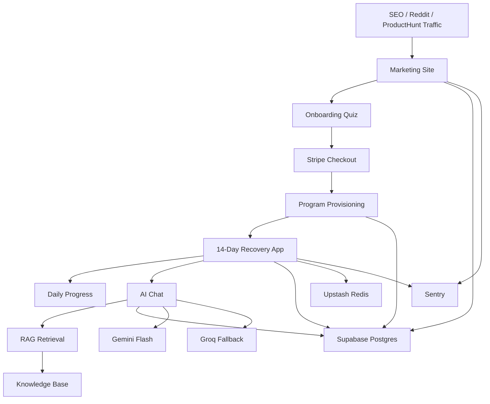

# 技术架构详细设计：Fracture Recovery AI Companion

> 版本：v1.0
> 日期：2026-04-22
> 阶段：`技术方案`
> 上游输入：`产品Brief.md v1.2`、`路线图与MVP.md v1.1`
> 代码参考基线：`D:\work\MyStartupProject\lease-guard`

---

## 1. 目标与边界

本设计服务于首版 MVP：

- 海外英语用户
- 首版只做 `手指 / 掌骨` 骨折拆石膏前后 14 天
- `一次性 $14.99` 买断
- 交付 `问卷 -> 付费 -> 14 天计划 -> 每日打卡 -> AI 答疑 -> 分享/总结报告` 闭环

本阶段目标不是“写代码”，而是把下面 6 件事定清楚：

1. 系统怎么分层
2. 哪些 `lease-guard` 代码可直接复用
3. 数据模型怎么设计
4. 关键业务流怎么跑通
5. AI / RAG / 风险护栏怎么落地
6. 部署、监控、测试、环境变量怎么收口

---

## 2. 架构原则

### 2.1 业务优先于技术炫技

- 这是 `内容驱动 + AI 增强` 产品，不是 AI 技术展示项目
- 核心价值来自 `14 天结构化计划 + 高频焦虑场景答疑`，不是复杂 agent
- 所有技术决策优先支持 `更快上线、更低维护、更少踩坑`

### 2.2 最大化复用 `lease-guard`

- 基础设施层尽量直接复用
- 业务层彻底重写，不把“合同分析”的概念强行套进“骨折康复”
- 复用的目标是 `提速`，不是把旧模型改得面目全非

### 2.3 v1 只做英文单站

- 不继承 `lease-guard` 的多语言和 `[locale]` 路由结构
- 首版不引入 `next-intl`
- 用更简单的单语言路由换更低复杂度

### 2.4 先模板化，再智能化

- 14 天计划以 `模板 + 少量规则` 为主
- LLM 只做 `微调、问答、解释、风险提醒`
- 不让模型直接生成完整治疗方案

### 2.5 合规保护前置

- 整个系统定位为 `education & companion`
- 不做诊断、不替代医生、不输出确定治疗结论
- 危险信号命中时强制升级为 `停止建议 + 联系医生`

---

## 3. 与 `lease-guard` 的复用策略

## 3.1 可直接复制

以下文件或模式建议直接复制，再做最小改名：

- `lease-guard/next.config.ts`
- `lease-guard/src/lib/prisma.ts`
- `lease-guard/src/lib/query-client.ts`
- `lease-guard/src/components/providers/index.tsx`
- `lease-guard/src/components/providers/query-provider.tsx`
- `lease-guard/src/components/providers/session-provider.tsx`
- `lease-guard/playwright.config.ts`
- `lease-guard/instrumentation.ts`
- `lease-guard/sentry.client.config.ts`
- `lease-guard/sentry.server.config.ts`
- `lease-guard/sentry.edge.config.ts`
- `lease-guard/scripts/verify-env.ts` 的校验脚本模式

直接复用原因：

- 这些文件基本属于 `Next.js SaaS 基础设施`
- 与“合同分析”业务耦合低
- 已经在真实项目中跑过，稳定性高于重新搭建

## 3.2 需要改造后复用

### 鉴权

参考：

- `lease-guard/src/lib/auth.ts`

改造原则：

- 删除 `GoogleProvider`
- 保留 `EmailProvider (Magic Link)`
- 保留开发态 `CredentialsProvider`
- 删除大段调试日志与双语租房文案
- Session 字段改为当前产品需要的最小集合

### 支付

参考：

- `lease-guard/src/lib/stripe/config.ts`
- `lease-guard/src/lib/stripe/subscription-service.ts`
- `lease-guard/src/app/api/stripe/checkout/route.ts`

改造原则：

- 从 `subscription` 改为 `one-time payment`
- 不保留 `FREE / PRO / TEAM` 套餐表
- 不保留 billing portal、续费、变更套餐逻辑
- 新建 `purchase-service.ts`
- webhook 以 `checkout.session.completed` 为主

### 限流

参考：

- `lease-guard/src/lib/security/rate-limiter.ts`
- `lease-guard/src/lib/security/usage-tracker.ts`

改造原则：

- 保留“纯函数判定 + 单独服务层”的结构
- 只用于 `AI chat 每日额度`
- 不复用设备共享限制逻辑
- 聊天额度优先走 `Upstash Redis`，数据库只保留聚合统计

## 3.3 明确不复用

- `next-intl` 与 `[locale]` 路由
- 合同上传 / PDF 解析 / OCR / 多文件上传
- 报告、条款、合同等领域模型
- 订阅套餐、月度额度、团队版
- 面向中国 provider 的 AI 降级链
- 合同分析 prompt 与报告导出逻辑

---

## 4. 目标系统总览



---

## 5. 逻辑分层

### 5.1 展示层

- `Marketing`：Landing、Blog、Legal、Pricing CTA
- `App`：Onboarding、Day View、Chat、Progress、Completion Report

### 5.2 应用层

- `auth`：登录、session、访问控制
- `onboarding`：问卷收集与 profile 生成
- `program`：14 天计划生成、日视图、完成度
- `billing`：Checkout、Webhook、解锁
- `chat`：RAG 检索、LLM 调用、风险护栏、额度控制
- `analytics`：漏斗事件与产品指标

### 5.3 领域层

- `RecoveryProfile`
- `Program`
- `ProgramDay`
- `Purchase`
- `ChatConversation / ChatMessage`
- `KnowledgeDocument / KnowledgeChunk`

### 5.4 基础设施层

- Next.js 16 App Router
- Prisma + Supabase Postgres
- NextAuth.js v4
- Stripe Checkout
- Upstash Redis
- Vercel AI SDK
- Sentry
- Plausible / Umami

---

## 6. 目录与模块设计

建议的新项目结构：

```text
src/
  app/
    (marketing)/
      page.tsx
      pricing/page.tsx
      blog/[slug]/page.tsx
      legal/privacy/page.tsx
      legal/terms/page.tsx
      legal/refund/page.tsx
      legal/disclaimer/page.tsx
    (app)/
      onboarding/page.tsx
      checkout/success/page.tsx
      progress/page.tsx
      day/[day]/page.tsx
      chat/page.tsx
      complete/page.tsx
    api/
      auth/[...nextauth]/route.ts
      onboarding/route.ts
      checkout/route.ts
      stripe/webhook/route.ts
      program/current/route.ts
      program/day/[day]/complete/route.ts
      chat/route.ts
      share/route.ts
      cron/reminders/route.ts
    layout.tsx
  components/
    marketing/
    onboarding/
    day-plan/
    chat/
    progress/
    shared/
    providers/
    ui/
  lib/
    auth/
    billing/
    program/
    chat/
    rag/
    safety/
    analytics/
    env/
    prisma.ts
    query-client.ts
  content/
    programs/
    faq/
    blog/
  prisma/
    schema.prisma
  scripts/
    verify-env.ts
    ingest-knowledge.ts
    seed-programs.ts
```

设计要点：

- 用 `(marketing)` 和 `(app)` 分开 SEO 页面与登录后产品页
- 不引入 `[locale]`
- `content/` 直接存 Git 管理的结构化内容，不上 CMS
- `lib/program` 和 `lib/chat` 是首版核心业务模块

---

## 7. 路由拓扑

## 7.1 Public Routes

- `/`：Landing
- `/pricing`：价格与 FAQ
- `/blog/[slug]`：SEO 长尾内容
- `/legal/privacy`
- `/legal/terms`
- `/legal/refund`
- `/legal/disclaimer`

## 7.2 Auth / Conversion Routes

- `/onboarding`
- `/checkout/success`

说明：

- `onboarding` 默认允许未登录状态开始
- 提交问卷或支付前自动创建 / 绑定用户身份
- Magic Link 成为统一身份恢复机制

## 7.3 Protected App Routes

- `/progress`
- `/day/[day]`
- `/chat`
- `/complete`

访问规则：

- 未登录 -> 跳转登录
- 已登录但未付费 -> 跳回 `/pricing` 或 `/onboarding`
- 已付费但无 program -> 走自动补建流程

## 7.4 API Routes

- `POST /api/onboarding`
- `POST /api/checkout`
- `POST /api/stripe/webhook`
- `GET /api/program/current`
- `POST /api/program/day/[day]/complete`
- `POST /api/chat`
- `POST /api/share`

## 7.5 关键页面 UX 结构草案

以下不是高保真视觉稿，而是用于 `implementation readiness` 和后续 `stories` 拆解的结构定稿。

### Landing Page

目标：

- 在 30-60 秒内让用户理解“这不是泛康复内容站，而是拆石膏后 14 天结构化恢复陪伴”
- 把用户从 `焦虑搜索` 推到 `开始问卷`

建议区块顺序：

1. Hero
   - 主标题：强调 `critical 2 weeks after cast removal`
   - 副标题：强调 `daily exercises + AI answers + $14.99 one-time`
   - 主 CTA：`Start my 2-minute quiz`
   - 次 CTA：`See how the 14-day plan works`
2. 痛点区
   - 医生复查只有几分钟
   - Google 信息碎片化
   - 怕动错、怕耽误恢复
3. How it works
   - 2 分钟问卷
   - 一次性付款
   - 每日动作 + AI 答疑
4. What you get
   - 每日动作卡
   - 计时器
   - AI 问答
   - 完成报告
5. Safety / Disclaimer
   - 明确 `Not a medical device`
   - 明确出现危险信号要联系医生
6. FAQ
   - 价格
   - 适用人群
   - 不适用人群
   - 退款
7. Footer CTA
   - 重复主 CTA

必须有的状态：

- 正常首屏
- FAQ 展开
- CTA 点击进入问卷
- 不适用用户跳转免责声明页或显示 warning

### Onboarding

目标：

- 在不压垮用户的前提下收集生成计划所需最小信息
- 在问卷结束时形成“这计划是为我定的”感知

建议 3 步结构：

1. Eligibility & Safety Gate
   - 是否已就医
   - 是否仍在固定期
   - 是否属于非目标人群
   - 若命中排除条件，立即停止并给出就医/不适用提示
2. Recovery Profile
   - 部位 / 子类型
   - 拆石膏日期
   - 是否有钢板或螺钉
   - 是否被建议转诊 PT
   - 疼痛程度
   - 惯用手是否受影响
   - 工作类型
3. Personalized Summary + Checkout CTA
   - 展示你当前处于哪个恢复窗口
   - 展示接下来 14 天能获得什么
   - 显示价格、免责声明、退款说明
   - CTA：`Unlock my 14-day plan`

必须有的状态：

- 进度条（Step 1/3, 2/3, 3/3）
- 上一步 / 下一步
- 字段校验
- 非目标用户中止
- 支付前 summary

### Day Page

目标：

- 用户进入后不思考导航，只思考“今天照着做”
- 把 `完成` 变成当天的核心心理奖励

建议结构：

1. 顶部恢复状态
   - Day X / 14
   - 当前阶段（例如 stiffness reduction / early mobility）
   - 总进度条
2. Today’s Focus
   - 今天的唯一目标说明
   - 今天做完后你应该期待什么
3. Exercise Cards
   - 视频
   - 动作名
   - 次数 / 时长
   - 注意事项
   - 是否完成
4. What’s Normal vs Get Help
   - 正常反应
   - 危险信号
5. Quick Questions
   - 常见 FAQ 快捷入口
   - `Ask AI about today`
6. Sticky Bottom Action
   - `Mark day complete`
   - 若未完成全部动作，给确认提醒

必须有的状态：

- 未完成
- 部分完成
- 当天已完成
- 超过当日后回看
- day 不存在 / 未解锁

### Chat Page

目标：

- 让用户把“焦虑问题”快速问掉
- 同时不让 AI 被误用成诊断工具

建议结构：

1. Context Header
   - 你的部位
   - 当前 Day
   - 今日剩余提问次数
2. Suggested Prompts
   - `Is this stiffness normal today?`
   - `When can I type more comfortably?`
   - `Should swelling still happen after exercise?`
3. Chat Stream
   - AI 回答
   - 引用来源
   - 危险信号时高亮警告框
4. Input Area
   - 文本框
   - 发送按钮
   - disclaimer

必须有的状态：

- 正常回答
- provider fallback
- danger escalation
- quota exceeded
- network error

### UX 收口结论

当前项目已具备足够的产品和技术定义，但还缺一个“低歧义页面骨架层”。在进入 `epics/stories` 之前，至少应把上述四类页面结构视为冻结输入，避免后续 stories 一边拆一边改页面信息架构。

---

## 8. 数据模型设计

## 8.1 设计原则

- `User` 与 `Auth` 模型沿用 NextAuth 标准
- 商业实体最少化，不做复杂账单系统
- 内容模板与用户实例分离
- 聊天记录、进度记录、知识库分开存

## 8.2 推荐模型

### User / Account / Session / VerificationToken

直接延续 `lease-guard/prisma/schema.prisma` 的 NextAuth 标准表。

### RecoveryProfile

记录一名用户当前恢复案例的问卷信息。

核心字段建议：

- `id`
- `userId`
- `bodyPart`：`FINGER` | `METACARPAL`
- `subType`
- `castRemovedAt`
- `hasHardware`
- `referredToPt`
- `painLevel`
- `dominantHandAffected`
- `jobType`
- `notes`
- `riskFlagsJson`
- `createdAt`
- `updatedAt`

### Purchase

记录一次性支付结果。

核心字段建议：

- `id`
- `userId`
- `stripeCheckoutSessionId`
- `stripePaymentIntentId`
- `stripeCustomerId`
- `amount`
- `currency`
- `status`：`PENDING` | `PAID` | `FAILED` | `REFUNDED`
- `paidAt`
- `refundAt`
- `createdAt`

### Program

一份购买后生成的 14 天计划实例。

核心字段建议：

- `id`
- `userId`
- `recoveryProfileId`
- `purchaseId`
- `templateVersion`
- `startDate`
- `endDate`
- `currentDay`
- `status`：`ACTIVE` | `COMPLETED` | `EXPIRED`
- `generatedSummaryJson`
- `createdAt`
- `updatedAt`

### ProgramDay

存每一天的结构化内容和完成状态。

核心字段建议：

- `id`
- `programId`
- `dayIndex`
- `stage`
- `contentJson`
- `estimatedMinutes`
- `completedAt`
- `completionPercent`
- `createdAt`
- `updatedAt`

### ExerciseAsset

动作演示素材目录。

核心字段建议：

- `id`
- `slug`
- `title`
- `bodyPart`
- `stage`
- `videoUrl`
- `thumbnailUrl`
- `durationSeconds`
- `instructionsJson`
- `contraindicationsJson`

### ChatConversation / ChatMessage

记录 AI 问答与风险升级结果。

`ChatConversation`：

- `id`
- `userId`
- `programId`
- `status`
- `createdAt`

`ChatMessage`：

- `id`
- `conversationId`
- `role`
- `content`
- `citationsJson`
- `provider`
- `model`
- `escalated`
- `tokenUsageJson`
- `createdAt`

### KnowledgeDocument / KnowledgeChunk

知识库与向量检索。

`KnowledgeDocument`：

- `id`
- `sourceType`：`AAOS` | `NHS` | `GUZHE` | `FAQ`
- `title`
- `slug`
- `version`
- `metadataJson`
- `createdAt`

`KnowledgeChunk`：

- `id`
- `documentId`
- `chunkIndex`
- `content`
- `embedding Unsupported("vector(1536)")`
- `keywords`
- `metadataJson`

## 8.3 关于本地数据库策略

原 Brief 写的是 `SQLite(dev) + PostgreSQL(prod)`，但本架构建议做如下收紧：

- `默认开发环境`：直接使用 Supabase Postgres
- `可选离线开发`：仅在做纯 UI 开发时才用 SQLite
- `涉及 RAG / webhook / 真支付 / 真实 schema` 的开发与测试，一律以 Postgres 为准

原因：

- `pgvector` 是核心能力
- SQLite 与 Postgres 的 schema 漂移会增加维护成本
- 早期项目更怕“开发环境能跑、线上结构不同”

---

## 9. 核心业务流设计

## 9.1 Onboarding -> Checkout -> Program Provisioning

1. 用户从 SEO / Reddit 进入 Landing
2. 点击 CTA 进入 `/onboarding`
3. 提交问卷，写入 `RecoveryProfile`
4. 若未登录，触发 Magic Link 登录 / 账号绑定
5. 调用 `POST /api/checkout`
6. Stripe 支付完成，webhook 写 `Purchase`
7. webhook 或成功页触发 `Program` 与 14 条 `ProgramDay` 初始化
8. 用户跳转 `/day/1`

设计决策：

- `Program` 生成在支付后执行，不在支付前预生成
- 避免未支付用户大量占用生成与存储资源

## 9.2 Day View -> Completion

1. `/day/[day]` 读取 `ProgramDay`
2. 渲染动作、视频、计时器、注意事项、FAQ
3. 用户完成打卡
4. `POST /api/program/day/[day]/complete`
5. 更新 `ProgramDay.completedAt` 与 `Program.currentDay`
6. 当 Day 14 完成后生成总结页与 PDF

## 9.3 AI Chat

1. 用户输入问题
2. 校验用户是否已购、是否在日额度内
3. 执行危险信号关键词检测
4. 组装上下文：
   - 用户 `RecoveryProfile`
   - 当前 `ProgramDay`
   - 检索出的知识块
   - 系统安全提示词
5. 先走 `Gemini Flash`
6. 失败时降级 `Groq`
7. 返回回答 + 引用来源 + 是否触发就医提示
8. 记录 `ChatMessage`

## 9.4 Share / Referral

首版只做简单分享，不做邀请码系统：

- 生成分享链接
- 附带已完成天数或总结页
- 埋点 `share_click`

---

## 10. Program 生成策略

首版不做全 AI 生成康复计划，采用 `模板优先`：

### 10.1 三层生成模型

1. `模板层`
   - 按部位、阶段预写 14 天计划骨架
2. `规则层`
   - 根据问卷映射到不同模板变体
3. `LLM 微调层`
   - 调整说明语气
   - 生成个性化 FAQ
   - 不允许改动动作安全边界

### 10.2 为什么这样设计

- 首版合规风险更低
- 内容质量更稳定
- 便于人工审核
- 能与 `guzhe` 真实案例结合
- 降低 token 成本

---

## 11. AI / RAG / Safety 设计

## 11.1 知识源

首版只允许 4 类来源进入知识库：

- AAOS 官方公开资料
- NHS hand therapy 指南
- `guzhe` 英文化案例
- 人工精校 FAQ

## 11.2 索引方式

- 文档切 chunk
- 生成 embeddings
- 写入 `KnowledgeChunk`
- metadata 记录 `bodyPart`、`phase`、`riskLevel`

## 11.3 检索策略

- 默认 top-k = 5
- 先按 `bodyPart`、`phase` 过滤，再做向量检索
- 命中风险主题时追加固定 safety context

## 11.4 Prompt 护栏

系统 prompt 必须固定包含：

- `You are not a doctor`
- `Do not diagnose`
- `Do not override physician instructions`
- `If symptoms suggest danger, instruct user to contact a clinician immediately`

危险词最小集合：

- `severe pain`
- `purple`
- `blue`
- `numb`
- `fever`
- `pus`
- `cannot move`
- `sudden swelling`

命中后策略：

- 回答内容缩短
- 不继续给动作建议
- 强制插入就医提示
- `ChatMessage.escalated = true`

## 11.5 限流策略

- 每用户每日 AI chat `20` 次
- 使用 `Upstash Redis`
- key：`chat:{userId}:{yyyy-mm-dd}`
- 达上限后返回：
  - 当天额度用尽提示
  - FAQ / 静态帮助链接

说明：

- 不复用 `lease-guard` 那套月度上传 / 设备共享逻辑
- 本产品早期更关注 `LLM 成本`，不是多人共用账号

---

## 12. 鉴权与访问控制

### 12.1 鉴权方案

- NextAuth.js v4
- 主方案：Magic Link Email
- 开发环境：保留 Credentials 快捷登录

### 12.2 会话字段建议

Session 中只保留：

- `user.id`
- `user.email`
- `user.hasPurchase`
- `user.activeProgramId`

不要把大段产品状态塞进 JWT。

### 12.3 访问控制中间规则

- Public 页面：全部开放
- App 页面：要求登录
- Day / Chat 页面：要求已购且有 `Program`
- API：统一用 server session 校验

---

## 13. 支付设计

### 13.1 结算模型

- 单 SKU
- 一次性支付
- Stripe Checkout

### 13.2 建议实现

- 新建 `src/lib/billing/purchase-service.ts`
- `POST /api/checkout` 创建 Checkout Session
- `POST /api/stripe/webhook` 负责解锁

### 13.3 必保留事件

- `checkout.session.completed`
- `payment_intent.payment_failed`
- `charge.refunded`

### 13.4 不做的东西

- 不做 billing portal
- 不做升级/降级
- 不做订阅状态同步
- 不做复杂税务逻辑

---

## 14. 观测、分析与测试

## 14.1 监控

沿用 `lease-guard/instrumentation.ts` 与 Sentry 配置：

- 页面错误
- API 错误
- Stripe webhook 错误
- AI provider 错误

## 14.2 产品埋点

建议事件：

- `landing_view`
- `cta_click`
- `quiz_start`
- `quiz_submit`
- `checkout_start`
- `paid`
- `day_completed`
- `chat_sent`
- `chat_escalated`
- `share_click`
- `completion_report_view`

## 14.3 测试策略

### 单元测试

- program template mapping
- safety keyword detection
- billing status mapping
- env validation

### 集成测试

- onboarding -> purchase -> program creation
- chat retrieval + escalation
- completion update

### E2E

复用 `lease-guard/playwright.config.ts`，首批只保留 4 条主干：

- landing -> onboarding -> checkout
- paid user -> day 1 complete
- paid user -> chat
- day 14 -> completion report

---

## 15. 部署拓扑

### 15.1 生产环境

- Frontend / API：Vercel
- DB：Supabase Postgres + pgvector
- Auth Email：Resend
- Payment：Stripe
- Cache / Rate limit：Upstash Redis
- Monitoring：Sentry
- Analytics：Plausible 或 Umami
- Video：Cloudflare Stream 或 YouTube Unlisted

### 15.2 环境变量分组

#### Core

- `NEXT_PUBLIC_APP_URL`
- `NEXTAUTH_URL`
- `NEXTAUTH_SECRET`

#### Database

- `DATABASE_URL`
- `DIRECT_URL`

#### Email

- `RESEND_API_KEY`
- `EMAIL_FROM`

#### Billing

- `STRIPE_SECRET_KEY`
- `STRIPE_WEBHOOK_SECRET`
- `NEXT_PUBLIC_STRIPE_PUBLISHABLE_KEY`
- `STRIPE_PRICE_ID_ONE_TIME`

#### AI

- `GOOGLE_GEMINI_API_KEY`
- `GROQ_API_KEY`

#### Infra

- `UPSTASH_REDIS_REST_URL`
- `UPSTASH_REDIS_REST_TOKEN`
- `SENTRY_DSN`

#### Optional

- `NEXT_PUBLIC_ANALYTICS_DOMAIN`
- `VIDEO_BASE_URL`

### 15.3 环境校验

建议直接复制 `lease-guard/scripts/verify-env.ts` 的结构，但改成当前项目变量名和校验规则。

---

## 16. 关键技术决策（ADR 摘要）

### ADR-001：继续沿用 `Next.js 16 + React 19 + Vercel`

- 决策：接受
- 原因：与 `lease-guard` 共栈，复用最多，SEO 与 App Router 都合适

### ADR-002：首版放弃多语言与 `[locale]`

- 决策：接受
- 原因：v1 只做英文，先减复杂度

### ADR-003：默认开发也使用 Postgres

- 决策：接受
- 原因：RAG 的 pgvector 是核心能力，避免 SQLite / Postgres 双轨漂移

### ADR-004：计划生成采用模板优先

- 决策：接受
- 原因：质量更稳，风险更低，更适合医疗边界

### ADR-005：支付只做一次性 Checkout

- 决策：接受
- 原因：业务简单，直接匹配 MVP 定价

---

## 17. 当前不做什么

- 不做原生 App
- 不做 CMS
- 不做多语言
- 不做订阅
- 不做诊断型 AI
- 不做医生端 / 诊所端
- 不做复杂 referral 激励
- 不做复杂设备共享限制

---

## 18. 实施顺序建议

按工程依赖顺序，建议开发顺序如下：

1. 复制 `lease-guard` 基础骨架
2. 删掉合同分析与多语言残留
3. 建 Prisma schema 与 Supabase
4. 接 Magic Link
5. 接 Stripe 一次性 Checkout + webhook
6. 做 onboarding 与 program provisioning
7. 做 day view / progress
8. 做 AI chat + RAG + safety
9. 做埋点 / Sentry / E2E

---

## 19. 本阶段结论

- 当前 `技术方案` 已可进入文档层面的 detailed design
- 以 `lease-guard` 为基础栈是正确决策，但应只复用基础设施，不复用业务模型
- 首版最重要的技术收敛点有 4 个：
  - 单语言单站
  - 一次性支付
  - 模板优先的 14 天 Program
  - 安全护栏明确的 RAG Chat

## 20. 下一阶段入口

推荐下一步：

- 主入口：`bmad-check-implementation-readiness`
- 并行补充：`bmad-agent-ux-designer`（若要先把 Landing / Onboarding / Day 页面结构定得更稳）

如果直接进入开发，风险不在“技术做不出来”，而在：

- UX 还未充分收口
- story 还没拆
- 内容模板与动作资产还没结构化

